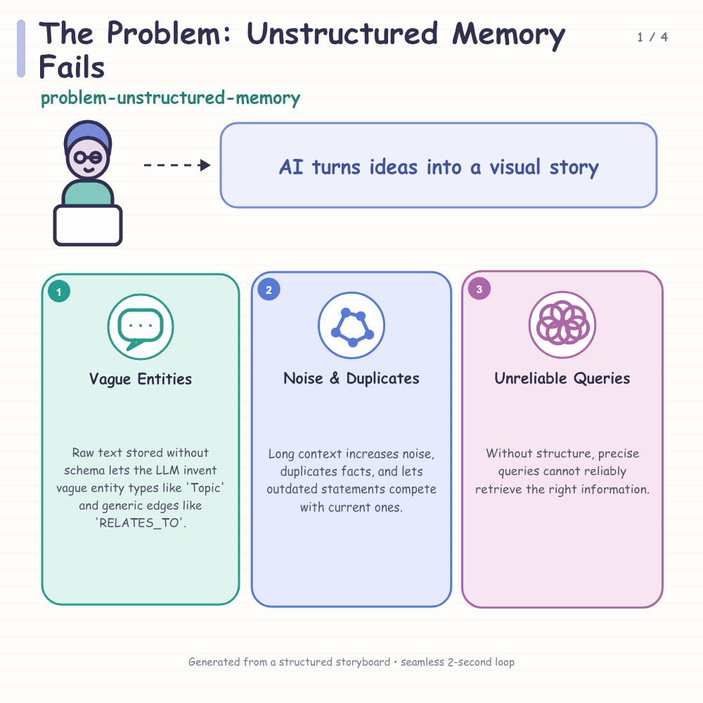
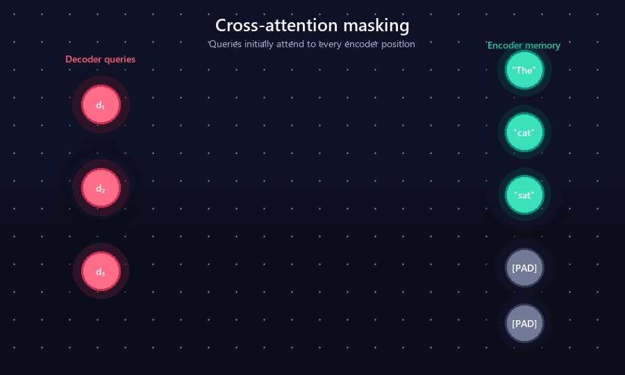

# AI / Agent 漫画信息图 GIF 生成流水线

本项目研究并实现了一条从技术文章到漫画风解释 GIF 的自动化流水线。系统先用 LLM 阅读全文、规划章节和术语，再生成结构化 storyboard，最后在本地完成确定性排版和 GIF 渲染。



## 项目成果

- 支持长文章的“全文规划 → 分章节分镜”，而不是机械地逐段生图；
- 支持 DeepSeek 和 OpenAI 两种 LLM API；
- 使用 JSON Schema/Zod 验证模型输出；
- 每页最多三个信息卡，保证可读性；
- 使用统一的粉彩漫画模板和局部循环动画；
- 保存 `plan.json`、`storyboard.json` 和 `manifest.json`，便于检查和人工修改；
- GIF 渲染完全在本地完成，不依赖视频生成模型。

## 两个阶段的对比

第一阶段验证了 Agent 可以生成可执行的 Canvas 动画，但画面偏理工风：



第二阶段在分析 LinkedIn 参考 GIF 后，改为“LLM 内容规划 + 漫画模板 + 程序化渲染”的混合方案。最终 DeepSeek 示例见 `output/final_demo`。

## 快速运行（DeepSeek）

```powershell
cd C:\Users\shackelten\gif_test
npm.cmd install
$env:DEEPSEEK_API_KEY="你的新 DeepSeek API Key"
$env:LLM_PROVIDER="deepseek"
$env:LLM_MODEL="deepseek-v4-flash"
npm.cmd run llm -- .\examples\long_article.md .\output\my_test --plan-only
```

确认 `output/my_test/plan.json` 后，运行完整流程：

```powershell
npm.cmd run llm -- .\examples\long_article.md .\output\my_test
```

不要把真实 API Key 写进源代码、Markdown、`.env.example` 或提交记录。

## 关键文件

| 文件 | 作用 |
|---|---|
| `generate_with_llm.mjs` | DeepSeek/OpenAI 双供应商的两阶段 LLM 规划 |
| `comic_pipeline.js` | 本地漫画排版与 GIF 渲染器 |
| `examples/long_article.md` | 测试长文章 |
| `output/final_demo/` | 真实 DeepSeek 规划生成的最终示例 |
| `linkedin_reference.gif` | 老师提供的风格参考 |
| `RESEARCH_PROCESS.md` | 完整调研、路线比较和迭代过程 |
| `PROJECT_SUMMARY.md` | 项目架构、实现和结论 |

## 阅读顺序

1. 先看本页和 `output/final_demo`；
2. 阅读 `RESEARCH_PROCESS.md` 了解思考与迭代；
3. 阅读 `PROJECT_SUMMARY.md` 了解程序结构、运行方式和后续方向。

